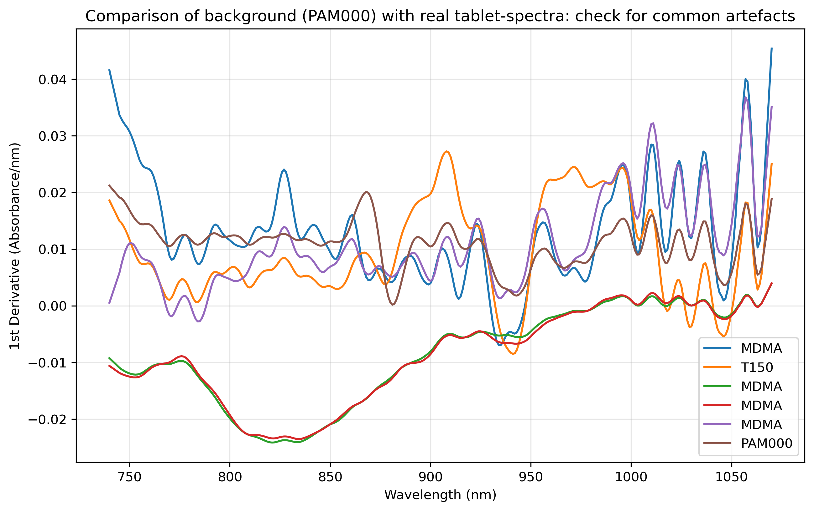
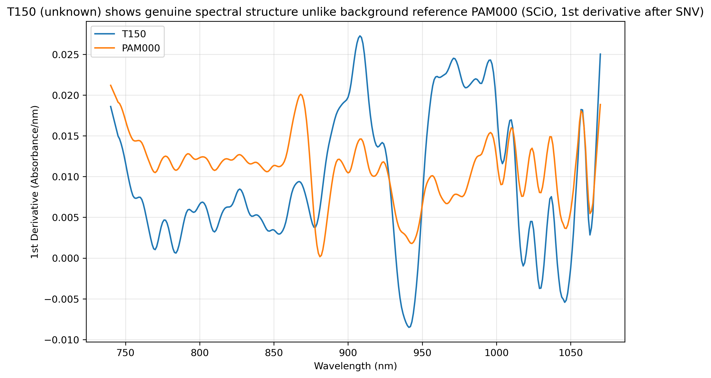

## 1. Motivation
The objective of this project is to ascertain whether the class of a substance 
can be identified with precision.
Therefore, the utilisation of NIR spectral data from a range of both legal and 
illegal substances is employed, with the measurement being conducted using five 
distinct instruments. The data has been published by Kranenburg et al., and this 
research is of significance firstly for On-Site Drug-Checking.
This non-destructive, low-level method, for which no specialists are required, 
has the capacity to clarify whether the sample has been identified with certainty, 
or whether further chemical (or physical) analysis is required in a laboratory to 
facilitate identification. The spectra presented herein have been obtained through 
the utilisation of four distinct portable near-infrared (NIR) spectrometers and a 
laboratory-based one used as a benchmark, each operating within a distinct 
wavelength range. The products under discussion are distinguished by their ease
 of use and affordability. The challenge is threefold: first, to utilise a 
database with comparison spectra in order to ensure the quality of the data; secondly, 
to develop algorithms for preprocessing; thirdly, to engineer an appropriate 
machine-learning model and evaluate it across the various instruments.
## 2. Data
Research Article: Kranenburg, Ruben F. et al. 
"The importance of wavelength selection in on-scene identification of drugs of 
abuse with portable near-infrared spectroscopy" DOI: 10.1016/j.forc.2022.100437

Data Article: Kranenburg, Ruben F. et al. "Dataset of near-infrared spectral 
data of illicit-drugs and forensic casework samples analyzed by five portable 
spectrometers operating in different wavelength ranges" DOI: 10.1016/j.dib.2022.108660

Data: DOI: 10.21942/uva.21252300 (Lizenz CC-BY)

The data is not included in the repository due to restrictions on the licence; 
however, it can be downloaded using the Digital Object Identifier (DOI) provided above.

**Instruments (NIR-spectrometers)**

|Instrument|Wave-length range (nm)| Raw data output (data points)| Resolution (FWHM)|
| :---- | :-----| :----- | :----- |
ASD LabSpec 4 | 350-2500 |2151 | 10|
NeoSpectra | 1300-2600|160|16|
NIRone 2.0 | 1550-1950|201|15-21|
MicroNIR|950-1650|125|12.5|
SCiO|740-1070|331|n.a.|

**Sample-Sets**

|Symbol|Explanation|Count|
| :---- | :----- | :----- |
|C| Common drugs|17|
|D|Designer drugs|38|
|N|Cocaine-negative samples, adulterants (powdered, white)|40|
|PAM|Police Amsterdam powdered casework samples|104|
|K|Calibration set of binary cocaine mixtures|88|
|T|Tablets|72|
|P|Crushed, powdered tablets|71|

A **total of 430 samples**have been analysed, divided between five instruments or 
24 spectral data sets.

## 3. Data quality findings

### 3.1 SCiO reflectance transform 
The SCiO-raw data are measured in reflectance; consequently, they are transformed 
to the corresponding absorption values using the Lambert-Beer formula. The 
Lambert-Beer formula is the formula for the calculation of the 
negative logarithm of reflected intensity relative to white reference.
Kranenburg et al. employed a similar methodology. The following details are 
provided in order to serve as background information for the SCiO. The PAM000 
data is identified below. It is not stated in the data paper whether the 
background has been subtracted. As a consequence of the implementation of a 
SNV transformation for the purpose of normalising the data, the background is not removed.  

### 3.2 Background reference PAM000
Given the observation that PAM000 is present exclusively within the SCiO dataset, 
it was hypothesised that this may be indicative of a background measurement. 
PAM000 (background reference scan) was evaluated against type-level spectral 
centroids across all sample sets (tablets, crushed tablets, adulterants, cocaine mixtures).
Across the entire dataset, PAM000 demonstrated no discernible discriminatory 
affinity for any particular substance class. The highest correlation coefficients 
were moderate in nature and exhibited a broad distribution (MDMA: 0.43 in T-set; 
no_controlled_substance: The NCD-set yielded a result of 0.32, while the K-set 
produced a result of 0.09 for cocaine. The raw-domain comparison confirms that 
PAM000 is devoid of substance-specific absorbance patterns, exhibiting only a near-linear baseline. 
It is concluded that PAM000 is a white-reference measurement devoid of any controlled substance content.

*Figure 1: Comparison of PAM000 with 4 tablets. It exhibits weak structure 
(particularly <950 nm), indicating a near-constant background.
(1st derivative, SNV-normalized)*

### 3.3 Unidentified sample T150 

T_scio set consists of 72 samples, but it has only 71 entries in the metadata-file. 
The comparison with the T-spectral-data of the other instruments shows that the sample
labeled T150 is only present in the SCiO-data.
The spectral comparison with the T_ASD-data falsifies the hypothesis, that "T150" is a typo. The Top-candidate
would be T32 (MDMA) with = 0.74. 
The varaince of the first derivative shows that T150 is a tablet spectrum (Rank 4 of 72) over the
PAM000 background (Figure 2)

Supplementary observation: T150 was compared against type-level centroids 
of all SCiO sample sets. Highest similarity was observed for 
2C-B_phenethylamine-psychedelics (r=0.85), while the top pairwise ASD 
candidate (T32) is an MDMA tablet. The two independent analyses point to 
different substance classes, reinforcing that no reliable assignment exists. 
Exclusion stands.

*Figure 2: T150 displays spectral dynamics comparable to genuine tablets, unlike the flat background curve PAM000. 
(1st derivative, SNV-normalized)*

